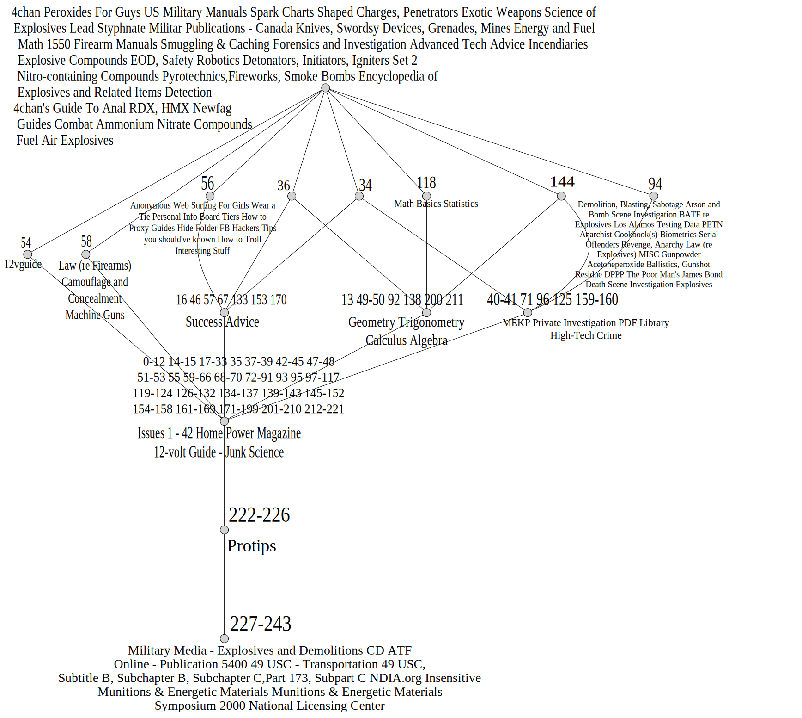

# clj_exploration_leaks
This repository is a collection of code snippets for working with formal contexts.
Not only methods for reading, displaying, manipulating and saving formal contexts are provided, 
but also a novel technique of topic aggregation via formal concept analysis (FCA) is introduced.
The idea extends ["The Geometric Structure of Topic Models", Johannes Hirth and Tom Hanika (2024)](https://arxiv.org/abs/2403.03607), 
where the authors compute document-topic incidences and apply FCA as means to visualize the information.
We extend this idea by computing directory-topic incidences.
Hence, we can aggregate topics on a higher level, which is particularly useful for the exploration of large corpora.
The workflow is as follows:


The result for the dataset [EYNTKE](https://archive.org/details/ETYNTKE) is shown below:


## conexp-clj

When running certain methods of conexp-clj I ran into compatibility problems:
While the highest supported Java version is 21, the library requires a Java 23/ openjdk-23-jdk.
It is possible to overcome this issue by rather using a standalone jar 
than the default web repository from maven/ clojars.
In order to install the standalone jar with java 21 use the following command:
```shell
mvn install:install-file -Dfile=/home/kgutekunst/IdeaProjects/conexp-clj/builds/uberjar/conexp-clj-2.6.0-standalone.jar -DgroupId=conexp-clj -DartifactId=conexp-clj -Dversion=2.6.0+java21 -Dpackaging=jar
```

## Usage
If you want to create the formal context across multiple directories, you can use the following code snippet:
```clojure
lein run -m clj-exploration-leaks.exploration
```
If you don't want the metadata, file tree and statistics functionality, 
you have to comment out the respective lines (up to the last `let`block) in the code.
Be aware that the code assumes that the data is stored under certain directory names which are defined in the `let` block
 and have to be adjusted to fit your needs.
Moreover, the data merged into the directory-topic context has to be aquired beforehand.
I have a second repository for this purpose, which your can find here:
[text_topic](https://github.com/KlaraGtknst/text_topic).

## License
MIT License

Copyright (c) 2024 - 2025 KlaraGtknst

Permission is hereby granted, free of charge, to any person obtaining a copy of this software and associated documentation files (the "Software"), to deal in the Software without restriction, including without limitation the rights to use, copy, modify, merge, publish, distribute, sublicense, and/or sell copies of the Software, and to permit persons to whom the Software is furnished to do so, subject to the following conditions:

The above copyright notice and this permission notice shall be included in all copies or substantial portions of the Software.

THE SOFTWARE IS PROVIDED "AS IS", WITHOUT WARRANTY OF ANY KIND, EXPRESS OR IMPLIED, INCLUDING BUT NOT LIMITED TO THE WARRANTIES OF MERCHANTABILITY, FITNESS FOR A PARTICULAR PURPOSE AND NONINFRINGEMENT. IN NO EVENT SHALL THE AUTHORS OR COPYRIGHT HOLDERS BE LIABLE FOR ANY CLAIM, DAMAGES OR OTHER LIABILITY, WHETHER IN AN ACTION OF CONTRACT, TORT OR OTHERWISE, ARISING FROM, OUT OF OR IN CONNECTION WITH THE SOFTWARE OR THE USE OR OTHER DEALINGS IN THE SOFTWARE.
